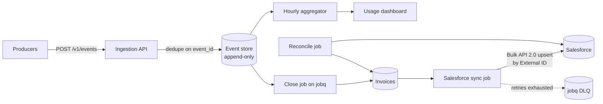

# Usage Metering & Billing Pipeline

[](https://github.com/Rishavbhattarai/usage-metering-billing/actions/workflows/ci.yml)

A pipeline that turns raw usage events, such as API calls or gigabytes stored, into monthly invoices and syncs customers and invoices to Salesforce. Raw events are never edited, so every invoice amount can be recomputed from the events that produced it.

**Stack:** Python 3.12, FastAPI, PostgreSQL 16, SQLAlchemy (async), Alembic, [jobq](https://github.com/Rishavbhattarai/distributed-job-queue) (Redis + Postgres job queue), Salesforce (SFDX, custom objects, External IDs, Bulk API 2.0, JWT bearer auth via simple-salesforce), HTMX, Hypothesis, pytest, mypy (strict), Ruff, Docker Compose, GitHub Actions

## Highlights

- Ingests 1,000,000 events with 10% duplicates at 38,568 events/s and stores exactly the 900,129 unique ones. Deduplication is `INSERT ... ON CONFLICT DO NOTHING` on a client-supplied event ID, so producers can retry any batch.
- Replays the full event log (999,589 events) twice into an empty database and rebuilds all 200 invoices with SHA-256 hashes identical to the stored ones and to each other.
- Books late events as adjustment lines on the next invoice, priced at the old period's marginal rate. Late usage that crosses a tier is charged at the new tier's price, and late usage under a minimum commit costs $0.
- Runs month-end close, Salesforce sync and reconciliation as jobs on jobq. In the demo, a forced Salesforce failure is retried by jobq. A longer outage sends the sync to jobq's dead-letter queue (DLQ), and replaying it from the DLQ brings drift back to 0.
- Reconciles the ledger with Salesforce record by record. After 1M events and two closed months, the ledger and Salesforce both total $29,403,835.60 with zero drift.
- Prices usage with a pure rating engine (flat, graduated tiers, minimum commit) that uses `Decimal` and integer cents and rejects floats. Hypothesis property tests cover tier boundaries, monotonicity and rounding.
- Re-rates any closed period from raw events and diffs it against the stored invoices line by line, for example after a price fix.
- 107 tests, including integration tests against real Postgres and the real Salesforce client against mocked HTTP. CI also runs the whole Docker stack end to end.

## Architecture



Invoices are computed from raw events and each period's cutoff time, not from the hourly rollups, so they can be recomputed at any time. The hourly rollups feed the dashboard. Design and data model: [docs/design.md](docs/design.md).

| ADR | Decision |
|---|---|
| [0001](docs/adr/0001-integer-cents-and-rounding.md) | Integer cents, `Decimal` math, half-up rounding once per invoice line |
| [0002](docs/adr/0002-aggregation-strategy.md) | Aggregator recomputes whole hour cells from raw events (idempotent) |
| [0003](docs/adr/0003-late-events.md) | Late events become next-invoice adjustments; closed invoices never change |
| [0004](docs/adr/0004-what-to-sync-to-salesforce.md) | Only aggregates go to Salesforce, never raw events |
| [0005](docs/adr/0005-bulk-api-vs-rest.md) | Bulk API 2.0 for batches, REST for single records |

## Quickstart

```bash
docker compose up -d --build --wait   # API on 8001, jobq API on 8002, Postgres on 5433

curl -s localhost:8001/v1/events/batch -H 'content-type: application/json' -d '{"events": [
  {"event_id":"e1","customer_id":"c1","meter":"api_calls","quantity":"10","occurred_at":"2026-09-01T10:00:00Z"},
  {"event_id":"e1","customer_id":"c1","meter":"api_calls","quantity":"10","occurred_at":"2026-09-01T10:00:00Z"}
]}'
# {"received":2,"accepted":1,"duplicates":1}

sleep 60   # the close cutoff is now() - 60 s, so in-flight ingests are never missed (ADR 0003)
curl -s -X POST localhost:8001/v1/periods/2026-09/close     # {"job_id": "..."}: close -> sync -> reconcile
curl -s localhost:8001/v1/periods/2026-09/reconciliation    # drift 0, ledger total == Salesforce total
open http://localhost:8001/dashboard

docker compose down -v
```

The stack builds jobq from GitHub. Host ports can be changed with `API_PORT`, `JOBQ_API_PORT` and `POSTGRES_PORT`. Salesforce is an in-memory fake unless you use `docker-compose.salesforce.yml` (see [Salesforce setup](#salesforce-setup)). The full 1M-event demo is in [loadtest/](loadtest/README.md).

Interactive API docs: http://localhost:8001/docs

## API

| Method | Path | Notes |
|---|---|---|
| `POST` | `/v1/events` | One event. Returns `{received, accepted, duplicates}`. |
| `POST` | `/v1/events/batch` | `{"events": [...]}`, up to 5,000 per batch. Atomic and safe to retry. |
| `GET` | `/v1/events/{event_id}` | The stored event. |
| `GET` | `/v1/customers/{id}/usage?period=YYYY-MM&granularity=daily\|hourly` | Aggregated usage and estimated charges so far. |
| `POST` | `/v1/aggregate` | Run the aggregator once (it also runs every second in its own service). |
| `POST` | `/v1/periods/{period}/close` | Enqueue the month-end close on jobq. Idempotent per period. |
| `POST` | `/v1/periods/{period}/sync`, `/reconcile` | Enqueue a Salesforce sync or a reconciliation (`?repair=true` re-sends drifted records). |
| `GET` | `/v1/periods`, `/v1/periods/{period}/reconciliation` | Closed periods with totals and drift; latest drift report. |
| `GET` | `/v1/invoices`, `/v1/invoices/{id}` | Invoices with lines and content hash. |
| `GET` | `/v1/invoices/{id}/rerate`, `/v1/periods/{period}/rerate` | Recompute from raw events and diff. |
| `GET` | `/v1/jobs/{job_id}` | Job status from jobq. |
| `GET` | `/dashboard` | Customer usage dashboard (Jinja + HTMX, refreshes every 5 seconds). |

An event has `event_id` (the idempotency key), `customer_id`, `meter`, `quantity` (decimal string, up to 6 decimal places) and `occurred_at` (ISO 8601 with a timezone).

## Salesforce setup

The `salesforce/` folder is an SFDX project with External ID fields on `Account`, the custom objects `Usage_Summary__c` and `Invoice__c`, and a permission set for the integration user. [docs/salesforce-setup.md](docs/salesforce-setup.md) walks through creating a free Developer Edition org, deploying the metadata, configuring JWT bearer authentication and running the live sync. Credentials go in `.env` and the private key stays outside the repo.

The live Salesforce path has not run against a real org yet. It is tested against mocked HTTP; CI and the demo use the fake.

## Development

```bash
uv venv --python 3.12 .venv && uv pip install --python .venv/bin/python -e ".[dev]"
.venv/bin/ruff check . && .venv/bin/ruff format --check . && .venv/bin/mypy
docker compose up -d postgres         # integration tests use TEST_DATABASE_URL
.venv/bin/pytest -q
```

Integration tests skip when Postgres is unreachable. Migrations: `alembic upgrade head`. The `metering` CLI covers the same operations: `seed-plans`, `aggregate`, `close-period`, `sync`, `reconcile`, `rerate`, `replay-check`, `fake-sf`.

```
src/metering/
  api/            FastAPI app, dashboard templates, vendored htmx
  ingestion.py    idempotent inserts with accepted and duplicate counts
  aggregation.py  hourly rollups (recompute dirty cells)
  rating/         money, price plans, rating engine
  pricing.py      price plan versions in Postgres
  invoicing.py    month-end close, late-event adjustments, content hashes, re-rating
  replay.py       replay the event log into a scratch database
  jobs/           JobQueue interface, jobq adapter, billing job handlers
  salesforce/     client interface, fake, real client (Bulk API 2.0), sync, reconciliation
migrations/       Alembic
salesforce/       SFDX project: custom objects, External IDs, permission set
tests/            unit/ (including Hypothesis) and integration/
loadtest/         bench.py, demo.py, generate_events.py, results/
docs/             design.md, adr/, salesforce-setup.md
```

## Roadmap

| Stage | Scope | Status |
|---|---|---|
| 1 | Ingestion API, append-only event store, deduplication | Done |
| 2 | Hourly and daily aggregation, price plans, rating engine | Done |
| 3 | Month-end invoices on jobq, late events booked as next-period adjustments, re-rating | Done |
| 4 | Salesforce sync with External ID upserts, retries and DLQ, reconciliation, usage dashboard | Done (live org not yet tested) |
| 5 | Load test, 1M-event demo, replay determinism, ADRs | Done |
| Stretch | Plan changes from Salesforce, proration, credit notes, PDF invoices | Not started |

## Results

Measured on an Apple M4 MacBook (10 cores, 16 GB RAM), Docker Desktop 29.8 with 10 CPUs and 7.7 GB for the VM. All services ran in Docker, and the load generator ran on the same machine. Raw output is in [loadtest/results/](loadtest/results/).

| Metric | Result |
|---|---|
| Ingestion throughput | 38,568 events/s: 1,000,000 events in 25.9 s, 8 concurrent clients, batches of 1,000 |
| Batch latency (1,000 events) | p50 185 ms, p95 372 ms, p99 597 ms |
| Deduplication | 1,000,000 sent, 99,871 duplicates dropped, 900,129 stored |
| Event-to-aggregate lag, during the 1M load | p50 2.2 s, p95 5.6 s (8 probes) |
| Event-to-aggregate lag, idle | p50 495 ms, p95 536 ms (30 probes, aggregator polls every 1 s) |
| Month-end close of 900k events via jobq | close, sync and reconcile of 100 invoices in 3.3 s |
| Replay determinism | 999,589 events replayed twice, 200 of 200 invoices with identical hashes, about 19 s per replay |
| Ledger vs Salesforce (fake) | $29,403,835.60 in both, drift 0 after a forced sync failure and jobq retry |
| DLQ round trip | Sync dead after 5 attempts, replayed from the DLQ, drift back to 0 |

One bottleneck found: the aggregator's join on an un-analyzed temp table took 205 s per pass at 900k events. Adding `ANALYZE` brought it to 2.1 s ([ADR 0002](docs/adr/0002-aggregation-strategy.md)).
