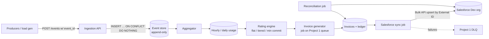

# Project 3: Usage Metering & Billing Pipeline

**One line:** A pipeline that turns raw usage events (GB stored, API calls) into correct monthly invoices and syncs customers and invoices to a Salesforce dev org. Every cent must be reproducible from the raw events.
**Target:** 4–5 weeks part-time · **Cost:** $0 · **Build order:** second (needs Project 1's queue)

> This is the flagship project for Salesforce and billing-platform roles. Prioritize it over Project 2.

---

## 1. Goals

- **Exactly-once effect** from ingestion through invoicing to Salesforce, using event IDs and idempotent upserts.
- **Deterministic money math:** replaying the event log gives byte-identical invoices.
- A real **Salesforce integration** (custom objects, External IDs, REST/Bulk API) with **reconciliation**.
- Reuse **Project 1's job queue** for month-end invoicing and the Salesforce sync.

## 2. Non-goals (out of scope)

- Real payment collection (Stripe charges, dunning). Stripe test mode is a possible stretch only.
- Tax calculation and multi-currency (single currency, USD).
- A full customer self-service portal.
- Production-grade Salesforce security review / managed package.

## 3. Stack (all free)

| Layer | Choice | Why |
|-------|--------|-----|
| Language / API | Python 3.12 + FastAPI | Same as Project 1. Imports its client library. |
| Event store and ledger | Postgres 16 (Docker) | Append-only tables. `NUMERIC` / integer cents. |
| Job queue | **Project 1** (Redis + workers) | Invoice generation, Salesforce sync, reconciliation jobs |
| Money | Python `Decimal` in code, `BIGINT` cents (or `NUMERIC(20,6)` for unit prices) in DB | Never floats |
| Salesforce | **[Salesforce Developer Edition](https://developer.salesforce.com/signup)** org (free, doesn't expire with regular use) | Custom objects, REST + Bulk API 2.0 |
| SF client | [`simple-salesforce`](https://github.com/simple-salesforce/simple-salesforce) (Python, free) + **Salesforce CLI** (`sf`) for metadata deploys | Object definitions live in the repo as source |
| SF auth | Connected App / External Client App with OAuth JWT bearer flow | Headless and CI-friendly |
| Usage dashboard | Simple web UI (FastAPI + HTMX or a small React/Vite page) | Free, no SF license needed |
| Tests | pytest + [Hypothesis](https://hypothesis.readthedocs.io) (property tests for rating math) + testcontainers | |
| CI | GitHub Actions. Salesforce calls are mocked in CI, with an optional manual workflow against the dev org. | Keeps CI free and doesn't burn API limits |

### Salesforce free-tier constraints to design around
- Developer Edition has a **daily API request limit** (about 15k per 24h) and **small data storage** (about 5 MB data). Sync **aggregates** (`Usage_Summary__c` per customer per month), never raw events.
- Use **Bulk API 2.0** for batch upserts so 1M events become a handful of API calls.
- Check current limits in Setup → *Company Information* / *System Overview*. Don't assume.

## 4. Architecture



| Component | Responsibility |
|-----------|----------------|
| **Ingestion API** | Accepts usage events with a client-supplied `event_id`. Duplicates are dropped (`UNIQUE(event_id)`). |
| **Event store** | Append-only Postgres table. Raw events are never edited. |
| **Aggregator** | Rolls events into hourly and daily usage per customer and meter |
| **Rating engine** | Pure functions that apply price plans (flat, tiered, minimum commit) to usage |
| **Invoice generator** | Month-end job on Project 1's queue. One invoice per customer per period, enforced by `UNIQUE(customer_id, period)`. |
| **Salesforce sync** | Upserts `Account`, `Usage_Summary__c`, `Invoice__c` via REST/Bulk API using External IDs |
| **Reconciliation job** | Compares Salesforce totals to the ledger and flags drift |

### Key data model (sketch)

```sql
usage_events(event_id text pk, customer_id, meter, quantity numeric, occurred_at, received_at)
usage_hourly(customer_id, meter, hour, quantity, primary key(customer_id, meter, hour))
price_plans(id, meter, model, tiers jsonb, min_commit_cents, effective_from)
invoices(id, customer_id, period, status, total_cents bigint, version int,
         unique(customer_id, period))
invoice_lines(invoice_id, meter, quantity, unit_price, amount_cents, is_adjustment bool)
sf_sync_log(entity, entity_id, sf_external_id, payload_hash, synced_at, status)
```

Salesforce objects (in `salesforce/force-app/` as SFDX source):
- `Account` + `Billing_Customer_Id__c` (External ID)
- `Usage_Summary__c`: Account lookup, Meter, Period, Quantity, `External_Key__c` (External ID)
- `Invoice__c`: Account lookup, Period, Total, Status, `Invoice_Ext_Id__c` (External ID)

## 5. Features

### Must-have (MVP)
- [ ] Idempotent ingestion (`event_id` dedupe) with batch endpoint
- [ ] Aggregation into hourly/daily usage
- [ ] Rating engine: flat, tiered (graduated), minimum commit, with property tests on tier boundaries
- [ ] Money stored as integer cents (or `Decimal`), never floats
- [ ] Month-end invoice generation as a Project 1 job, one per customer per period
- [ ] Late-arriving events: accepted until period close, then booked as an adjustment on the next invoice
- [ ] Re-rating: recompute a period from raw events and diff against the original invoice
- [ ] Salesforce sync with External ID upserts. Retries with backoff, and failures go to the DLQ, not lost.
- [ ] Reconciliation job: ledger vs Salesforce, drift report
- [ ] Simple customer-facing usage dashboard (web UI)

### Stretch
- [ ] Platform Events or Change Data Capture so plan changes in Salesforce flow back to the rating engine (Pub/Sub API, free in Dev Edition)
- [ ] Proration for mid-month plan changes
- [ ] Credit notes and invoice voiding with an audit trail
- [ ] Export invoices as PDF (WeasyPrint, free)
- [ ] Lightning Web Component on the Account page showing usage (free, built with `sf` CLI)

## 6. Milestones

| Week | Deliverable | Done when |
|------|-------------|-----------|
| 0 (prep) | Sign up for a Salesforce Developer Edition org, install `sf` CLI, create the Connected App | `sf org display` works. A JWT login from Python works. |
| 1 | Ingestion API, event store, dedupe | 10k events with 10% duplicates give exactly 9k unique rows |
| 2 | Aggregation, price plans, rating engine with unit + property tests on tier boundaries | Hypothesis tests pass. Hand-checked invoice examples match. |
| 3 | Invoice generation on the job queue; late events and adjustments | Closing a month twice still gives one invoice. A late event appears as next month's adjustment. |
| 4 | Salesforce objects, External IDs, sync and reconciliation | Records visible in the SF org. A forced failure plus retry ends with zero drift. |
| 5 | Load test, re-rating demo, README and ADRs | All success metrics below are published |

## 7. Success metrics

- **Ingestion throughput** (events/sec) and end-to-end lag from event to aggregate.
- **Determinism:** replaying the full event log twice produces byte-identical invoices (hash compare).
- **Reconciliation** shows zero drift between ledger and Salesforce after a forced sync failure and retry.

## 8. Demo

Send 1M events (including duplicates and late arrivals) locally, close the month, then show matching totals in the ledger, the invoice and the Salesforce record.

## 9. ADR candidates

1. Integer cents vs `NUMERIC`, and the rounding rule (where you round, and the banker's vs half-up choice)
2. Late events: reopen the invoice vs book an adjustment on the next one
3. What to sync to Salesforce (aggregates only, because of API and storage limits) and why
4. REST composite vs Bulk API 2.0 for the sync
5. Pull vs push for usage (event ingestion vs periodic metering snapshots)

## 10. Risks

| Risk | Mitigation |
|------|------------|
| Dev Edition API/storage limits | Sync aggregates only, use Bulk API, and mock Salesforce in CI and load tests |
| Floating-point drift | Ban `float` in money paths (lint rule / review). Use property tests. |
| OAuth / Connected App setup friction | Do it in Week 0 before writing code. Keep the private key out of git (`.env`, GitHub Actions secrets). |
| 1M-event demo is slow on a laptop | Use `COPY` for bulk insert and batch ingestion endpoints, and report the hardware |
| Experience Cloud needs licenses or setup | Use a plain web UI for the dashboard (stated as allowed in the original scope) |

## 11. Free hosting (optional)

Run on the same **Oracle Cloud Always Free** VM as Project 1 (they share Redis and the workers). Salesforce is already hosted for free. Expose the dashboard via **Cloudflare Tunnel**.
