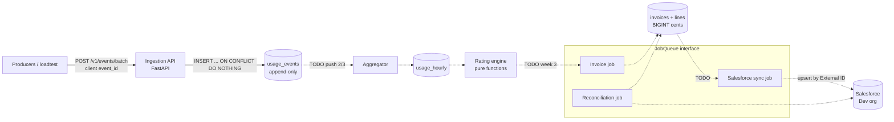
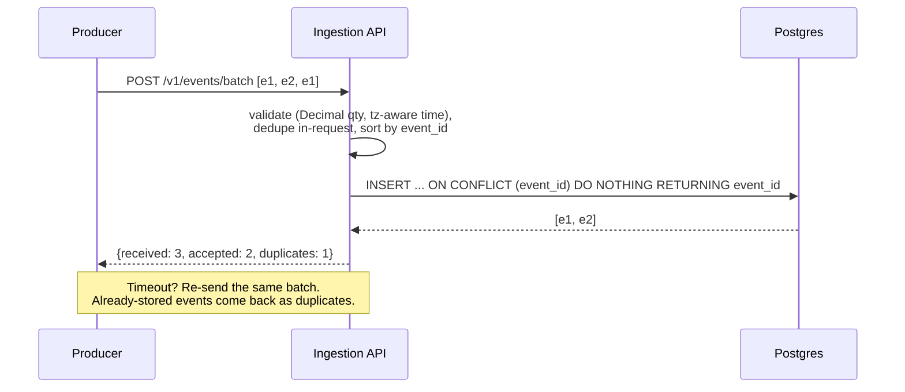

# Design: Usage Metering & Billing Pipeline

Status: Week 1 (ingestion) done. Week 2 rating engine started. See `SCOPE.md` for the full plan.

## Architecture

Solid lines are built. Dotted lines are planned.

## Ingestion: exactly-once *effect*

- The **producer owns `event_id`**. Producers retry at least once, and the database primary key
  makes the effect exactly-once. The guarantee lives in Postgres, so it holds across API
  replicas and concurrent requests (tested with 8 concurrent overlapping batches).
- **First write wins.** A re-used `event_id` with a different payload is counted as a duplicate
  and the original is kept. Producers must never reuse ids for different events.
- **Batches are atomic.** A batch is one transaction, so on any error nothing is stored and
  the whole batch can be retried.
- **Rows are sorted by `event_id`** before insert, so concurrent batches with overlapping ids
  take row locks in the same order and can't deadlock.
- **Append-only** is enforced by a trigger that rejects `UPDATE` and `DELETE` on
  `usage_events`. Corrections will be new adjustment rows, never edits.
- **Where the guarantee breaks:** if a producer generates a *new* `event_id` when it retries,
  that's a real double count, and nothing downstream can detect it. `event_id` must be
  derived from the source (for example `request_id`) or persisted before the first send.

## Data model (built so far)

| Table | Key | Notes |
|-------|-----|-------|
| `usage_events` | `event_id` PK | `quantity NUMERIC(20,6) >= 0`, `occurred_at`/`received_at timestamptz`. Index on `(customer_id, meter, occurred_at)`. Append-only trigger. |
| `usage_hourly` | `(customer_id, meter, hour)` | Created but not populated yet (aggregator is push 2/3). `hour` must be a UTC hour boundary (CHECK). |

Late events: `occurred_at` (when usage happened) is separate from `received_at` (when we
learned about it). Late events are accepted. Booking them as adjustments after period close
is Week 3.

## Rating engine (`src/metering/rating/`)

Pure functions with no I/O, clock or global state, so the same inputs always give the same output.

- `FlatPricing(unit_price)`: `quantity x unit_price`.
- `GraduatedPricing(tiers)`: tier *i* covers `(up_to[i-1], up_to[i]]`, and the last tier is
  unbounded. Each unit is charged at its own tier's price, and each touched tier becomes one line.
- `PricePlan(meter, pricing, min_commit_cents)`: `rate_with_minimum` adds a
  "minimum commit shortfall" line so that `total == max(usage, minimum)`.
- Money rules (exact multiplication, half-up rounding once per line, int cents) are in
  [ADR 0001](adr/0001-integer-cents-and-rounding.md).

## Integration seams

- **`JobQueue`** (`src/metering/jobs/queue.py`): `enqueue(job_type, payload, *,
  idempotency_key, priority, run_at)` and `get(job_id)`. `InProcessJobQueue` (the default)
  runs jobs inline. `Project1JobQueue` wraps Project 1's `jobq.client.AsyncJobqClient`,
  which it matches structurally without importing `jobq`. Switch with
  `Project1JobQueue.from_jobq()` after `pip install -e ../01-distributed-job-queue`
  (it reads `$JOBQ_URL`). jobq delivers at least once, so every job handler (invoice, sync,
  reconcile) must be idempotent: `UNIQUE(customer_id, period)` and External ID upserts.
- **`SalesforceClient`** (`src/metering/salesforce/client.py`): upserts by External ID only.
  `FakeSalesforceClient` copies the parts of Salesforce the sync depends on: upsert
  semantics, parent lookup by External ID, and injectable failures. CI never calls
  Salesforce. The real client is push 3/3.

## Salesforce model (`salesforce/force-app`)

| Object | External ID | Fields |
|--------|-------------|--------|
| `Account` | `Billing_Customer_Id__c` (Text 64, unique) | |
| `Usage_Summary__c` | `External_Key__c` = `customer:meter:YYYY-MM` | `Account__c` (lookup), `Meter__c`, `Period__c`, `Quantity__c` Number(18,6) |
| `Invoice__c` | `Invoice_Ext_Id__c` | `Account__c` (lookup), `Period__c`, `Total__c` Currency(16,2), `Status__c` (Draft/Finalized/Void) |

The `Billing_Integration` permission set grants object access and field-level security.
Without it, fields deployed through metadata can't be seen by the API user.

## Open questions / next ADRs

- 0002: how the aggregator works (recompute vs incremental). This is push 2/3.
- Late events: reopen the invoice or book an adjustment on the next one.
- Bulk API 2.0 vs REST composite for the sync.
