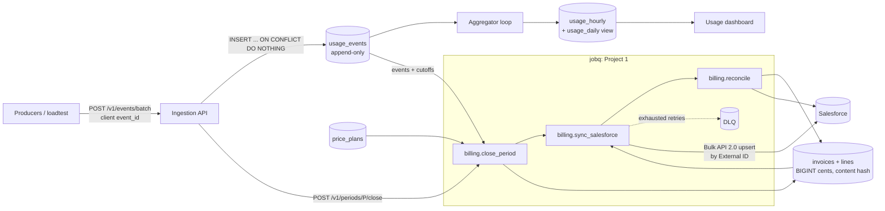
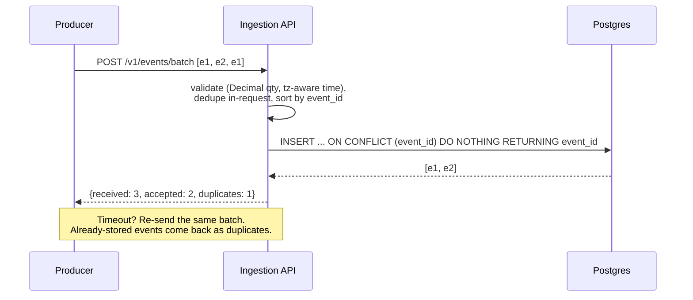
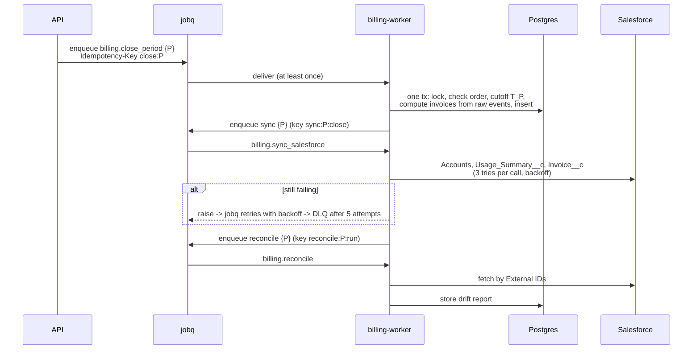

# Design: Usage Metering & Billing Pipeline

Scope: [SCOPE.md](../SCOPE.md). Decisions: [adr/](adr/). Measured results: [README](../README.md#results).

## Architecture

| Service (compose) | What it runs |
|---|---|
| `api` | FastAPI: ingestion, billing endpoints, dashboard. Enqueues jobs on jobq. |
| `aggregator` | `metering aggregate --loop`: dirty hour cells every second |
| `billing-worker` | `jobq-worker` with `JOBQ_HANDLER_MODULES=metering.jobs.handlers` |
| `jobq-api`, `jobq-reaper`, `redis` | Project 1, built from its GitHub repo |
| `postgres` | databases `metering`, `jobq`, `metering_test`, `metering_replay` |

## Ingestion: exactly-once effect

- The producer owns `event_id`. The primary key makes retries safe across API replicas and
  concurrent requests. First write wins.
- Batches are one transaction and are sorted by `event_id`, so overlapping concurrent batches
  can't deadlock.
- A trigger rejects `UPDATE` and `DELETE` on `usage_events`.
- **Where it breaks:** a producer that mints a new `event_id` on retry double counts, and
  nothing downstream can tell.

## Month-end close (jobq)

Every handler is idempotent because jobq delivers at least once. The close returns the stored
result for a closed period, the sync upserts by External ID, and chained jobs use idempotency
keys. A jobq cron schedule can trigger the close with `{"period": "previous"}`.

Late events and the cutoff rules are in [ADR 0003](adr/0003-late-events.md).

## Data model

| Table | Key | Notes |
|-------|-----|-------|
| `usage_events` | `event_id` | Append-only. Indexed by (customer, meter, occurred_at), received_at, occurred_at. |
| `usage_hourly` | (customer, meter, hour) | Recomputed cells (ADR 0002). `usage_daily` is a view. |
| `aggregation_state` | name | Aggregator watermark. |
| `price_plans` | id; unique (meter, effective_from) | flat or graduated tiers (JSONB, decimal strings), min commit in cents. New prices are new rows. |
| `billing_periods` | period | Cutoff `closed_at` per closed month. |
| `invoices` | id `inv_YYYY-MM_customer`; unique (customer, period) | total cents, SHA-256 of the canonical invoice JSON. |
| `invoice_lines` | (invoice_id, line_no) | kind usage / minimum / adjustment, usage_period, quantity, unit price, cents. |
| `sf_sync_log` | (entity, external_id) | Last synced payload hash and status. |
| `reconciliation_runs` | id | Drift report per run. |

## Rating engine

Pure functions in `src/metering/rating/`: flat, graduated tiers, minimum commit, with exact
`Decimal` math and half-up rounding once per line ([ADR 0001](adr/0001-integer-cents-and-rounding.md)).
Hypothesis checks that totals are never negative and never fall as usage rises, that flat
equals single-tier pricing, and that rounding error stays within half a cent per line.

## Determinism checks

- **Re-rate** (`GET /v1/periods/{p}/rerate`, `/v1/invoices/{id}/rerate`, `metering rerate`):
  recompute from raw events with the stored cutoffs and the current plans, then diff. A new
  plan version effective for an old period shows up as a per-line delta.
- **Replay** (`metering replay-check`): copy the event log, plans and cutoffs into an empty
  database in a different shuffled order per run, rebuild every invoice, and compare the
  hashes with the stored ones and across runs.

## Salesforce

See [ADR 0004](adr/0004-what-to-sync-to-salesforce.md) for what syncs and
[ADR 0005](adr/0005-bulk-api-vs-rest.md) for how. The metadata is in `salesforce/force-app`:
External IDs, lookups to Account, and a permission set for field access. CI and the demo use
`FakeSalesforceClient`, which persists to a JSON file so the worker and CLI share one fake org,
and supports injected failures and manual edits.
